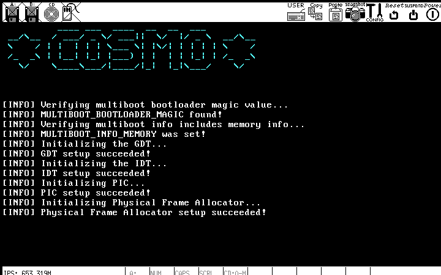

# cosmo

cosmo is a hobby x86 OS. The goal of the project is to implement a very basic
OS capable of running a Userland application from the ground up.

The table below shows what modules have been implemented to date. As the
project progresses, additional modules will be added.

| Module                   | Completed |
| ------------------------ | --------- |
| Framebuffer Driver       | Y         |
| Serial Port Driver       | Y         |
| Logger                   | Y         |
| GDT                      | Y         |
| IDT                      | Y         |
| PIC Driver               | Y         |
| Physical Frame Allocator | Y         |
| Virtual Memory Manager   | N         |
| User Mode Process        | N         |

Development has leaned heavily on the ["The litte bookabout os
development"](https://littleosbook.github.io/) as well as the the
[OSDev](https://wiki.osdev.org/Main_Page) forums as references. Plenty of the
source files and commit messages link back to reference material.

### Running cosmo in Bochs

cosmo was developed on a Linux PC using [Bochs](https://bochs.sourceforge.io/)
for x86 emulation.

#### Dependencies

To build and run cosmo on a Linux PC, you will need to install the following
dependencies:

* [Bochs](https://bochs.sourceforge.io/)
* [CMake3.13+](https://cmake.org/)
* [GNU Grub2](https://www.gnu.org/software/grub/)
* [GNU xorriso](https://www.gnu.org/software/xorriso/)
* [GNU mtools](https://www.gnu.org/software/mtools/)
* GCC Cross Compiler (see below)
* [Doxygen](https://www.doxygen.nl/index.html) (only needed to build project
  docs)

#### Installing the GCC Cross Compiler

It's best practice and required to use a cross-compiler to build cosmo. You can
modify and run the [`scripts/setup_toolchain.sh`](scripts/setup_toolchain.sh)
script to install the appropriate cross compilation tools on your system.

#### Build and Run

To build:
```
scripts/build_cosmo.sh
```

To run cosmo in the emulator:
```
scripts/run_cosmo.sh
```

If the above two commands succeed, you should see a Bochs window like the one
shown below.



### Project Documentation

Project docs can be viewed in HTML. To build the project documentation,
pass the `-d` flag to the [`scripts/build_cosmo.sh`](scripts/build_cosmo.sh)
script:

```
scripts/build_cosmo.sh -d
```

After running the above command, cosmo docs will be installed to the project
root directory under `docs/cosmo_docs`.
